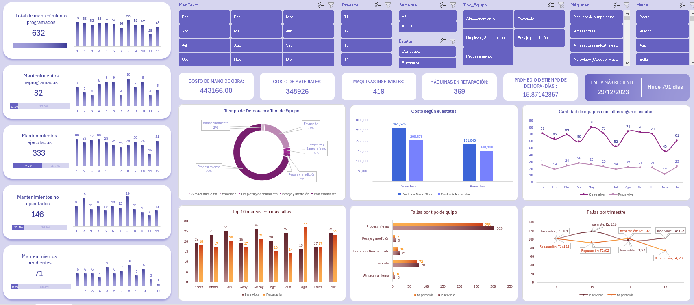

# Dashboard de Mantenimiento de Equipos - Seguimiento de Órdenes y Costos 2023

## Descripción General
Este repositorio contiene un **dashboard interactivo en Excel** para el seguimiento y control de mantenimiento de equipos industriales. La herramienta permite visualizar el estado de las órdenes de mantenimiento, costos asociados, diagnóstico de equipos (inservibles o en reparación), tiempos de demora por tipo de equipo, y análisis de fallas por marca, trimestre y tipo de equipo.

## Características Principales
- **Métricas Generales de Mantenimiento:**
  - **Total de mantenimientos programados** 
  - **Mantenimientos reprogramados** 
  - **Mantenimientos ejecutados** 
  - **Mantenimientos no ejecutados** 
  - **Mantenimientos pendientes**

- **Distribución Mensual:** Seguimiento de mantenimientos por mes (Enero a Diciembre) según su estado.

- **Costos Asociados:**
  - **Costo de Mano de Obra** 
  - **Costo de Materiales** 
  - **Costo por estatus:** Correctivo vs Preventivo 

- **Diagnóstico de Equipos:**
  - **Máquinas inservibles**
  - **Máquinas en reparación** 

- **Tiempo de Demora por Tipo de Equipo:**
  - Procesamiento
  - Envasado
  - Limpieza y Saneamiento
  - Pesaje y medición
  - Almacenamiento
  - Promedio general

- **Análisis de Fallas:**
  - **Top 10 marcas con más fallas** 
  - **Fallas por tipo de equipo** 
  - **Fallas por trimestre** 
  - **Cantidad de equipos con fallas por estatus** 

## Objetivo del Proyecto
Crear una herramienta de **gestión de mantenimiento** que permita a supervisores, jefes de planta y equipos de mantenimiento visualizar rápidamente el estado de las órdenes, identificar equipos críticos, controlar costos y optimizar la planificación de mantenimientos preventivos y correctivos.

## Objetivos del Proyecto
- **Consolidar información de mantenimiento:** Integrar datos de órdenes, equipos, diagnósticos, costos y tiempos en un solo lugar.
- **Visualizar el estado general:** Mostrar de forma clara cuántos mantenimientos están programados, ejecutados, reprogramados, no ejecutados y pendientes.
- **Controlar costos:** Tener visibilidad de los costos de mano de obra y materiales por tipo de mantenimiento.
- **Identificar equipos críticos:** Detectar qué tipos de equipo, marcas y trimestres concentran más fallas.
- **Optimizar tiempos de respuesta:** Analizar los tiempos de demora por tipo de equipo para mejorar la eficiencia.

## Insights Clave para el Negocio
- **Solo la mitad de los mantenimientos se ejecutan:** De 632 mantenimientos programados, solo 333 (52.7%) se ejecutaron. Esto significa que casi la mitad de las órdenes quedan pendientes, reprogramadas o no se ejecutan, lo que puede generar riesgos operativos.
- **Alto volumen de equipos inservibles:** 419 máquinas están diagnosticadas como inservibles, frente a 369 en reparación. Esto representa una **pérdida significativa de activos** que podría requerir inversión en reposición.
- **Procesamiento es el tipo de equipo más crítico:** Concentra 571 fallas (303 inservibles, 268 en reparación) y tiene el mayor tiempo de demora (4,056 días). Es el **principal cuello de botella** en la operación.
- **Las marcas Ciscoy y Mik son las más problemáticas:** Ambas con 47 fallas cada una, seguidas de Asis (45). Estas marcas deberían ser **prioridad en evaluaciones de calidad y proveedores**.
- **El segundo trimestre concentra más fallas:** Con 210 fallas, T2 supera ligeramente a T1 (203). Esto puede deberse a **factores estacionales** que requieren planificación anticipada.
- **Costo correctivo supera al preventivo:** El mantenimiento correctivo cuesta S/ 261,526 en mano de obra y S/ 200,578 en materiales, vs preventivo con S/ 181,640 y S/ 148,348. **Invertir más en preventivo podría reducir costos a largo plazo.**
- **Alta variabilidad mensual:** Diciembre tiene solo 48 mantenimientos programados vs 65 en Agosto. La **carga de trabajo no es uniforme**, lo que puede afectar la capacidad del equipo.

## Pasos Involucrados
1. **Recopilar y organizar los datos:** Se consolidó la información de cada orden de mantenimiento incluyendo: fecha, mes, trimestre, máquina, tipo de equipo, marca, actividades, estatus, diagnóstico, tiempos y costos.
2. **Calcular métricas clave:** Se obtuvieron totales, promedios y distribuciones usando tablas dinámicas y fórmulas en Excel.
3. **Crear visualizaciones:** Se diseñaron tablas y gráficos para mostrar:
   - Resumen general de mantenimientos por estado
   - Distribución mensual de órdenes
   - Costos de mano de obra y materiales
   - Diagnóstico de equipos (inservibles vs reparación)
   - Tiempos de demora por tipo de equipo
   - Top 10 marcas con más fallas
   - Fallas por tipo de equipo y trimestre
   - Cantidad de equipos con fallas por estatus
4. **Validar la información:** Se revisó que los datos fueran consistentes y reflejaran la realidad operativa.

## Habilidades Demostradas
- **Gestión de mantenimiento:** Seguimiento de órdenes, diagnósticos y costos asociados a equipos industriales.
- **Análisis de datos:** Interpretación de métricas de mantenimiento para tomar decisiones operativas y estratégicas.
- **Manejo de Excel:** Tablas dinámicas, fórmulas de conteo y suma, formato condicional.
- **Visualización de información:** Diseño claro de tablas y gráficos para facilitar la lectura de datos de mantenimiento.
- **Control de costos:** Capacidad para segmentar y analizar costos por tipo de mantenimiento y estatus.

## Funciones y Técnicas Utilizadas
- **Tablas dinámicas:** Para resumir órdenes por mes, estado, tipo de equipo, marca, trimestre y diagnóstico.
- **Fórmulas de conteo y suma:** `CONTAR`, `CONTAR.SI`, `SUMAR.SI`, `SUMA`, `PROMEDIO` para calcular métricas clave.
- **Formato condicional:** Para resaltar visualmente los valores más altos en fallas, costos y tiempos de demora.
- **Segmentación de datos:** Organización de la información por mes, trimestre, tipo de equipo y diagnóstico.
- **Cálculo de tiempos:** Determinación de días de demora por orden y promedio por tipo de equipo.

## Conclusión
Este dashboard de mantenimiento permite a empresas industriales tener una visión clara y rápida del estado de sus equipos y órdenes de mantenimiento. Con métricas de ejecución, costos, diagnósticos y análisis de fallas, los equipos de mantenimiento y gerencia pueden identificar oportunidades de mejora, optimizar la planificación de mantenimientos preventivos, reducir costos correctivos y tomar decisiones informadas sobre reposición de equipos.
